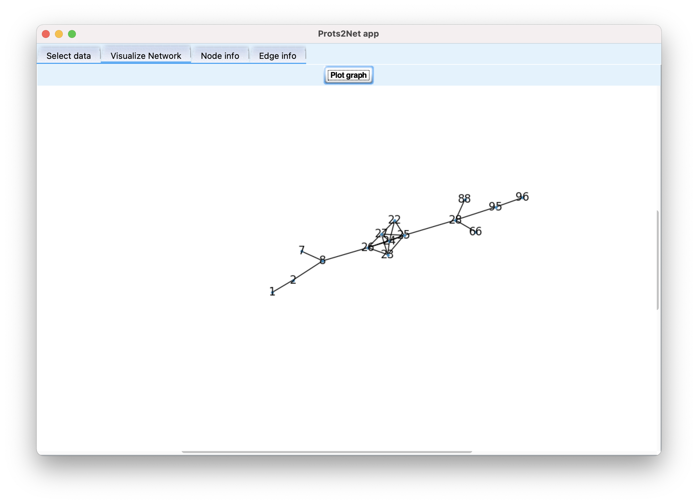

# Prots2Net

## Introduction
Prots2Net is a tool designed to predict the protein-protein interactions of a proteome or a metaproteome sample.
The prediction model is a multilayer perceptron neural network that  uses protein sequence information only from the input proteins 
and interaction information from the STRING database. To train the model, Prots2Net explores the PPINs retrieved from the 
STRING database of two selected species.

##How to install and execute
To install and execute Prots2Net, Python3.6+ is need. To execute it first install the dependencies in `requirements.txt` 
and then run with `python -m GUI.main`

## How to use
In the first stage of Prots2Net,  the user inserts the proteins sequences whose PPIs are required.
In the second stage, Prots2Nets predicts the interactions.  
And finally,  the user can visualize and analyze the network in the third stage.

### Graphical User Interface
The Prots2Net GUI consist in 4 different tabs:
1. A tab to insert data and compute the predicted network
2. A tab to visualize the predicted network
3. A tab to visualize the proteins
4. A tab to visualize the predicted interactions

#### Insert data

#### Visualize network

#### Visualize proteins

#### Visualize interactions

